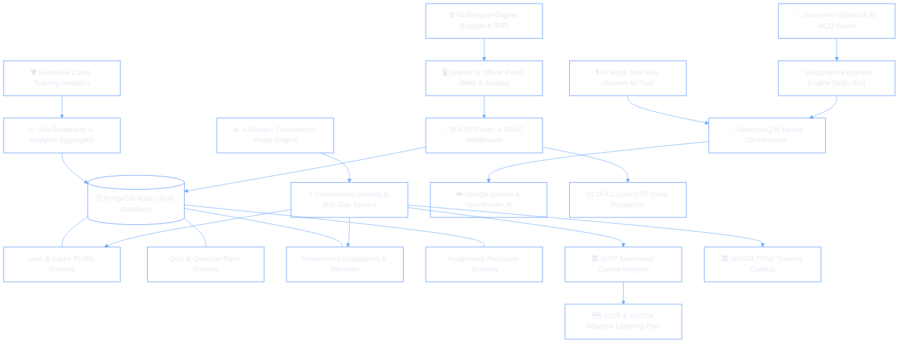
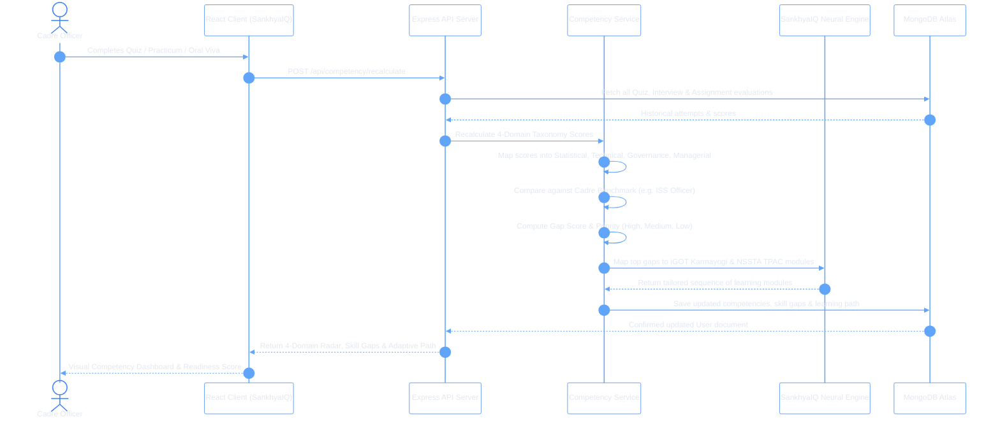
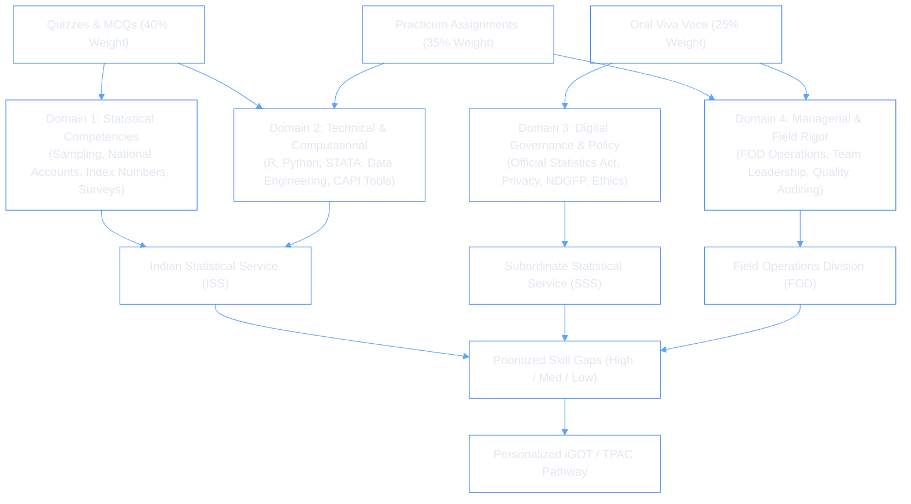

# 🏛️ SankhyaIQ™ — AI-Enabled Skill Intelligence & Capacity Building Platform
### Smart India Hackathon (SIH) 2026 • Problem Statement: 26101
#### Ministry of Statistics and Programme Implementation (MoSPI) • Government of India

<p align="center">
  
</p>

<p align="center">
  
</p>

---

## 🏆 Badges & Standards

<p align="center">
  
  
  
  
  
  
  
  
</p>

---

## 🌐 Multilingual Accessibility (English & हिन्दी Available)

To ensure nationwide inclusivity across all statistical directorates and regional survey field offices:
* **Languages Available:** **English (`en`)** and **हिन्दी (`hi`)**.
* **Configurable in Settings:** Seamless language selection via the **System Settings Portal** and quick settings modal with persistent local storage.
* **Target Inclusivity:** Tailored for **Field Operations Division (FOD)** investigators, enumerators, and regional statistical staff across Indian states who conduct ground-level surveys (PLFS, Consumer Expenditure, Agriculture Census) in Hindi and regional dialects.
* **Government Alignment:** Direct adherence to Government of India's **Digital India Bhashini Mission** for vernacular language enablement in public systems.
* **State Persistence:** Preserves selected language preferences across sessions in local client storage with instant reactive updates.

---

## 🌍 Live Deployment & Links

| Asset | Resource Link |
| :--- | :--- |
| **🚀 Production Web Application** | [https://ai-interview-two-sigma.vercel.app](https://ai-interview-two-sigma.vercel.app) |
| **💻 GitHub Source Repository** | [https://github.com/suvojitmanna/sih](https://github.com/suvojitmanna/sih) |
| **🏛️ Target Ministry Portal** | [Ministry of Statistics and Programme Implementation (MoSPI)](https://www.mospi.gov.in) |
| **🎓 Integrated Training Ecosystem** | [iGOT Karmayogi](https://igotkarmayogi.gov.in) • [NSSTA Academy](https://www.mospi.gov.in/national-statistical-systems-training-academy-nssta) |

---

## 🧠 Project Overview (SIH Problem Statement 26101)

### The Challenge
The **Official Statistical System of India**—spearheaded by the Ministry of Statistics and Programme Implementation (**MoSPI**) and the National Statistical Systems Training Academy (**NSSTA**)—coordinates critical nationwide statistical operations, including the **National Accounts Statistics (SNA 2008 / GDP compilation)**, **Consumer Price Index (CPI)**, **Index of Industrial Production (IIP)**, **Periodic Labour Force Survey (PLFS)**, **Annual Survey of Industries (ASI)**, and economic censuses.

**Problem Statement 26101** calls for an enterprise **AI-enabled learning platform** to strengthen capacity building across statistical cadres (**ISS, SSS, FOD, DES**) by:
1. Creating comprehensive competency profiles based on role, cadre, qualifications, and past performance.
2. Identifying granular skill gaps through dynamic assessment analytics.
3. Recommending tailored learning pathways directly integrated with **iGOT Karmayogi** and **NSSTA TPAC** training programmes.
4. Generating interactive quizzes and multiple-choice questions (MCQs) on-demand from uploaded survey manuals, administrative circulars, and study materials.
5. Providing accessible, multilingual capability for regional field officers.

### The Solution: SankhyaIQ™
**SankhyaIQ™** is an end-to-end AI-powered skill intelligence platform engineered to fulfill the mandate of Problem Statement 26101. Grounded in the **Mission Karmayogi FRAC (Framework for Roles, Activities, and Competencies)** standard, SankhyaIQ provides real-time competency calculation across a 4-domain knowledge taxonomy, automated skill gap ranking, AI document-to-MCQ generation, voice-assisted oral vivas, practical assignments, executive cadre analytics, and native English/Hindi multilingual operations.

---

## ✨ Key Capabilities & Features

### 1. 📊 Official MoSPI 4-Domain Knowledge Taxonomy
Measures and tracks capability across the four pillars of India's statistical infrastructure:
* **Statistical Competencies:** Sampling Design, Stratification, Variance Estimation, Multipliers, SNA 2008 GVA, CPI/WPI Index Numbers, Demography.
* **Technical & Computational Rigor:** Official Statistical Computing (R, Python, STATA), Big Data pipelines, CAPI (Computer-Assisted Personal Interviewing) data hygiene, Database queries.
* **Digital Governance & Ethics:** Official Statistics Act, Data Confidentiality, National Data Governance Framework Policy (NDGFP), Open Government Data (OGD) publishing.
* **Managerial & Field Leadership:** Field Operations Division (FOD) logistics, Enumerator oversight, Quality control audits, Cross-cadre coordination.

### 2. 🎯 Dynamic Skill Gap Analysis & Cadre Benchmarking
* Automatically evaluates learner performance across quizzes, practicum assignments, and oral vivas.
* Compares scores against official benchmark profiles for:
  * **Indian Statistical Service (ISS) Officers**
  * **Subordinate Statistical Service (SSS) Officers**
  * **Field Operations Division (FOD) Senior Investigators**
  * **State Directorate of Economics and Statistics (DES) Personnel**
* Classifies skill gaps by severity (**Critical / High Priority**, **Moderate**, **Low / Maintenance**) with operational impact rationale.

### 3. 🗺️ Adaptive Learning Pathways (iGOT Karmayogi & NSSTA Integration)
* Resolves identified skill gaps by dynamically mapping them to official digital modules from **iGOT Karmayogi** and residential/hybrid training from **NSSTA TPAC**.
* Constructs sequential milestone learning tracks with duration, skill addressed, target level, and completion tracking.

### 4. 📄 AI Document-to-MCQ & Quiz Studio
* Allows trainers and officials to upload official MoSPI documents (PDF, DOCX, TXT, PPTX).
* Extracts core text using `pdfjs-dist` and `mammoth` parsing engines.
* The **SankhyaIQ Neural Engine** generates validated 4-option MCQs with pedagogical explanations, correct answer validation, and source citations directly traceable to the manual.

### 5. 🌐 Bhashini Multi-Language Support (English & हिन्दी)
* Built-in dual-language localization engine supporting **English** and **हिन्दी**.
* Bridges the barrier between headquarters leadership (ISS) and grassroots field enumerators (FOD) in regional statistical rounds.

### 6. 🎙️ Multi-Modal Assessment Engine
* **Diagnostic Cadre Assessments:** Instant baseline evaluation upon cadre selection.
* **Topic & Domain Quizzes:** Timed assessments with interactive question palettes and instant analytics.
* **AI Oral Viva Voce:** Speech-to-text enabled simulated oral examinations evaluating communication and procedural clarity.
* **Assignment Practicums:** Real-world statistical problem statements with multi-parameter automated AI rubric grading.

### 7. 💬 SankhyaCopilot AI Domain Tutor
* Context-aware conversational AI assistant specializing in Indian official statistics, survey methodologies, sampling manuals, and administrative guidelines.

### 8. 🛡️ Executive Cadre Training Portal
* Cadre-wide skill distributions, department-wise radar comparisons, and deficit tracking for NSSTA decision-makers.

---

## 🛠️ Languages, Tools & Technology Stack

```
                                  SANKHYAIQ TECH STACK
┌────────────────────────────────────────────────────────────────────────────────────────┐
│  FRONTEND            React 19  •  Vite 8  •  Tailwind CSS v4  •  Redux Toolkit         │
│  LOCALIZATION        Bhashini-Aligned Multilingual Engine (English & हिन्दी)            │
│  UI & VISUALIZATION  Framer Motion  •  Recharts  •  React-Icons  •  Prism.js          │
│  BACKEND RUNTIME     Node.js (v20+)  •  Express.js (v5)  •  ES Modules (ESM)           │
│  DATABASE            MongoDB Atlas  •  Mongoose ODM (v9)                               │
│  AI NEURAL ENGINES   Google Gemini API (@google/genai)  •  OpenRouter (Meta/DeepSeek)  │
│  DOCUMENT PARSING    pdfjs-dist  •  adm-zip  •  Multer file streaming                  │
│  SECURITY & AUTH     2FA Crypto OTP  •  Nodemailer  •  JWT  •  BcryptJS  •  CORS       │
└────────────────────────────────────────────────────────────────────────────────────────┘
```

### Frontend
* **Core:** React.js 19, Vite 8, JavaScript (ES6+)
* **Multilingual:** Custom `LanguageContext` supporting English and हिन्दी (`en` and `hi`)
* **Styling & Motion:** Tailwind CSS v4, Framer Motion
* **State Management:** Redux Toolkit (`@reduxjs/toolkit`), React-Redux
* **Routing & Utilities:** React Router DOM v7, Axios, React Hot Toast
* **Visualization & Reporting:** Recharts (Radar, Bar, Line Charts), jsPDF, jsPDF-AutoTable

### Backend
* **Runtime & Framework:** Node.js, Express.js v5 (Modern REST Architecture)
* **Database & ODM:** MongoDB Atlas, Mongoose v9
* **Document Extraction:** `pdfjs-dist`, `adm-zip`, `multer`
* **Security & Communications:** JSON Web Tokens (JWT), BcryptJS, Cookie-Parser, Nodemailer (Crypto 6-digit OTP delivery)

### AI & Neural Capabilities
* **AI Frameworks:** Google Gemini API (`@google/genai`), OpenRouter Multi-Model Inference
* **Pedagogical Safeguards:** Built-in curated MoSPI cadre diagnostic fallback presets ensuring zero-latency and 100% uptime during network throttling.

---

## 🏗️ System Architecture & Data Flow



---

## 🔄 Sequence Diagrams

### 1. Competency Assessment & Dynamic Skill Gap Engine



---

### 2. Document-to-MCQ AI Extraction & Studio Pipeline

```mermaid
%%{init: {'theme': 'base', 'themeVariables': { 'background': 'transparent', 'mainBkg': 'transparent', 'primaryColor': 'transparent', 'primaryBorderColor': '#3b82f6', 'primaryTextColor': '#e2e8f0', 'lineColor': '#60a5fa' }}}%%
flowchart LR
    A["Official Survey Manual\n(PDF / DOCX / TXT)"] --> B["Multipart Multer\nUpload Stream"]
    B --> C["Document Extractor\n(pdfjs-dist / mammoth)"]
    C --> D["Structured Domain\nText Cleaning"]
    D --> E["SankhyaIQ AI\nNeural Prompting"]
    E --> F["JSON Structured\nValidation Gate"]
    F --> G["4-Option MCQs +\nDetailed Explanations +\nDocument Citations"]
    G --> H["Quiz Studio UI &\nInstant Learner Practice"]
```



---

### 3. MoSPI 4-Domain Framework & Cadre Benchmarking



---

## 📁 Project Directory Structure

```bash
sih/
├── client/                               # Frontend Single Page Application
│   ├── public/                           # Static assets and icons
│   ├── src/
│   │   ├── assets/                       # Images, logos, and graphics
│   │   ├── components/                   # Reusable UI components
│   │   │   ├── Navbar.jsx                # Government navigation with [🌐 EN | हिन्दी]
│   │   │   ├── Footer.jsx                # MoSPI & NSSTA footer
│   │   │   ├── ProtectedRoute.jsx        # JWT auth guard wrapper
│   │   │   └── ...                       # Modals, buttons, cards, skeletons
│   │   ├── context/                      # React Context providers
│   │   │   ├── LanguageContext.jsx       # English & हिन्दी Bhashini Localization
│   │   │   ├── ThemeContext.jsx          # Dark / Light theme provider
│   │   │   ├── NavigationContext.jsx     # Navigation and layout state
│   │   │   └── DiagnosticContext.jsx     # Mandatory intake diagnostics guard
│   │   ├── pages/                        # View Pages
│   │   │   ├── Home.jsx                  # Hero landing page & MoSPI portal overview
│   │   │   ├── Dashboard.jsx             # 4-Domain Competency radar & gap summary
│   │   │   ├── Auth.jsx                  # 2FA OTP Signup, Login & Password Reset
│   │   │   ├── LearningPath.jsx          # iGOT & NSSTA adaptive pathway tracker
│   │   │   ├── Quizzes.jsx               # Statistical quizzes exploration
│   │   │   ├── QuizPage.jsx              # Interactive timed quiz engine
│   │   │   ├── MaterialsUpload.jsx       # AI Document-to-MCQ Studio view
│   │   │   ├── Interview.jsx             # AI Speech-to-Text Mock Oral Viva Voce
│   │   │   ├── InterviewHistory.jsx      # Oral assessment evaluations archive
│   │   │   ├── AssignmentDetails.jsx     # Practical assignments & rubric evaluation
│   │   │   ├── JobReadinessReport.jsx    # Comprehensive cadre benchmark audit
│   │   │   ├── AdminDashboard.jsx        # Executive NSSTA Cadre Training Portal
│   │   │   ├── Community.jsx             # Statistical peer discussions & Q&A
│   │   │   ├── Settings.jsx              # User profile & cadre configuration
│   │   │   └── ...                       # Terms, Privacy, Difference pages
│   │   ├── redux/                        # Redux state slices & store
│   │   ├── utils/                        # Frontend helpers & API Axios client
│   │   ├── App.jsx                       # Master route declarations
│   │   ├── main.jsx                      # Application bootstrap with LanguageProvider
│   │   └── index.css                     # Tailwind CSS entrypoint
│   ├── index.html                        # HTML template
│   ├── package.json                      # Client dependencies & scripts
│   └── vite.config.js                    # Vite configuration
│
├── server/                               # Backend REST API Server
│   ├── config/                           # System Configurations
│   │   ├── db.js                         # MongoDB Mongoose connection
│   │   ├── competencyFramework.js        # 4-Domain taxonomy & cadre benchmarks
│   │   ├── gemini.js                     # Google Gemini SDK configuration
│   │   ├── token.js                      # JWT token utilities
│   │   └── imageKit.js                   # Media hosting configuration
│   ├── controller/                       # Route Business Controllers
│   │   ├── auth.controller.js            # 2FA OTP Registration, Login & Session
│   │   ├── competency.controller.js      # Dynamic scoring & skill gap recalculation
│   │   ├── material.controller.js        # Document upload & MCQ studio handler
│   │   ├── quiz.controller.js            # Quiz generation, retrieval & attempts
│   │   ├── interview.controller.js       # AI Voice Oral Viva evaluations
│   │   ├── assignment.controller.js      # Practicum submission & AI rubric grading
│   │   ├── admin.controller.js           # Cadre-wide analytics & distribution
│   │   ├── chat.controller.js            # SankhyaCopilot AI multi-turn tutor
│   │   ├── community.controller.js       # Peer discussions & posts
│   │   ├── supportMessage.controller.js  # User support messaging
│   │   └── user.controller.js            # Profile updates & cadre preferences
│   ├── middleware/                       # Request Interceptors
│   │   ├── isAuth.js                     # JWT authorization verification
│   │   └── multer.js                     # In-memory document buffer handling
│   ├── models/                           # Mongoose Database Schemas
│   │   ├── userModel.js                  # User, cadre, competency scores & gaps
│   │   ├── quizModel.js                  # Quizzes & generated MCQ questions
│   │   ├── quizAttemptModel.js           # Attempt records & domain analytics
│   │   ├── interviewModel.js             # Voice oral viva transcripts & feedback
│   │   ├── assignmentModel.js            # Practicums, submissions & AI rubrics
│   │   ├── materialModel.js              # Uploaded documents & extracted MCQs
│   │   ├── communityModel.js             # Forum posts & replies
│   │   └── supportMessageModel.js        # Feedback messages
│   ├── routes/                           # API Route Definitions
│   │   ├── auth.route.js                 # /api/auth endpoints
│   │   ├── competency.route.js           # /api/competency endpoints
│   │   ├── material.route.js             # /api/material endpoints
│   │   ├── quiz.route.js                 # /api/quiz endpoints
│   │   ├── interview.route.js            # /api/interview endpoints
│   │   ├── assignment.route.js           # /api/assignment endpoints
│   │   ├── admin.route.js                # /api/admin endpoints
│   │   ├── chat.route.js                 # /api/chat endpoints
│   │   └── user.route.js                 # /api/user endpoints
│   ├── services/                         # Business & AI Logic Services
│   │   ├── aiService.js                  # Gemini/OpenRouter AI generation engine
│   │   ├── competencyCalculationService.js# Dynamic scoring & gap analysis algorithms
│   │   ├── diagnosticAssessmentService.js # Cadre baseline assessment presets
│   │   ├── emailService.js               # Crypto OTP generation & 2FA emails
│   │   ├── igotService.js                # iGOT Karmayogi course catalog integration
│   │   ├── openRouter.service.js         # Secondary AI neural fallback engine
│   │   └── tpacService.js                # NSSTA TPAC programme registry
│   ├── utils/                            # Helper Utilities
│   │   └── documentExtractor.js          # PDF & Word text extraction routines
│   ├── index.js                          # Express app entrypoint & middleware
│   └── package.json                      # Server dependencies & scripts
│
└── README.md                             # Project documentation
```

---

## 🔐 Environment Variables (`.env`)

### 1. Server Environment Configuration (`server/.env`)

```env
# Server Network Settings
PORT=5000
NODE_ENV=development
CLIENT_URL=http://localhost:5173

# Database Connection
MONGODB_URL=mongodb+srv://<username>:<password>@cluster.mongodb.net/sankhyaiq?retryWrites=true&w=majority

# Security & Session Authentication
JWT_SECRET=your_super_secret_jwt_encryption_key_min_32_chars

# Artificial Intelligence Neural Engines (Primary & Secondary)
GEMINI_API_KEY=your_google_gemini_api_key_here
OPENROUTER_API_KEY=your_openrouter_api_key_here

# 2FA Crypto OTP Email Service (SMTP)
EMAIL_HOST=smtp.gmail.com
EMAIL_PORT=587
EMAIL_USER=your_official_email@gmail.com
EMAIL_PASSWORD=your_email_app_specific_password
EMAIL_FROM=no-reply@mospi.gov.in
EMAIL_FROM_NAME="MoSPI-NSSTA Skill Intelligence"

# Media Storage Configuration (Optional / Image Generation)
IMAGEKIT_PUBLIC_KEY=your_imagekit_public_key
IMAGEKIT_PRIVATE_KEY=your_imagekit_private_key
IMAGEKIT_URL_ENDPOINT=https://ik.imagekit.io/your_account
CLIPDROP_API_KEY=your_clipdrop_api_key_if_used
```

### 2. Client Environment Configuration (`client/.env`)

```env
# Backend API Base URL
VITE_BASE_URL=http://localhost:5000

# Google OAuth Client ID (Optional)
VITE_GOOGLE_CLIENT_ID=your_google_oauth_client_id_here
```

---

## ⚡ Installation & Local Setup Guide

### Prerequisites
* **Node.js**: v18.0.0 or higher
* **npm**: v9.0.0 or higher
* **MongoDB**: Local MongoDB instance or MongoDB Atlas URI

### Step 1: Clone Repository
```bash
git clone https://github.com/suvojitmanna/sih.git
cd sih
```

### Step 2: Configure & Run Server
```bash
# Navigate to server directory
cd server

# Install backend dependencies
npm install

# Create and configure .env file
cp .env.example .env # or create .env using the template above

# Start backend development server (runs on http://localhost:5000)
npm run dev
```

### Step 3: Configure & Run Client
```bash
# Open a new terminal and navigate to client directory
cd ../client

# Install frontend dependencies
npm install

# Start frontend development server (runs on http://localhost:5173)
npm run dev
```

Open your browser and navigate to **`http://localhost:5173`**.

---

## 🔗 Key API Endpoints Reference

| Module | Method | Endpoint | Description |
| :--- | :--- | :--- | :--- |
| **Authentication** | `POST` | `/api/auth/register` | Register new official & dispatch 6-digit 2FA OTP |
| **Authentication** | `POST` | `/api/auth/verify-otp` | Verify registration OTP & issue secure JWT |
| **Authentication** | `POST` | `/api/auth/login` | Authenticate official credentials & trigger 2FA |
| **Authentication** | `POST` | `/api/auth/verify-login-otp`| Complete 2FA login verification |
| **Competency Engine**| `GET` | `/api/competency/overview` | Fetch 4-domain scores, gaps, & radar metrics |
| **Competency Engine**| `POST`| `/api/competency/recalculate` | Dynamic multi-assessment score recalculation |
| **Materials / Studio**| `POST`| `/api/material/upload-and-generate` | Upload PDF/DOCX & auto-generate verified MCQs |
| **Materials / Studio**| `GET` | `/api/material/my-materials`| Retrieve uploaded manuals & extracted question sets |
| **Quiz Engine** | `GET` | `/api/quiz/catalog` | Retrieve available statistical quizzes by topic |
| **Quiz Engine** | `POST`| `/api/quiz/generate` | On-demand AI quiz generator for target topics |
| **Quiz Engine** | `POST`| `/api/quiz/submit` | Submit answers, calculate score & update competency |
| **AI Oral Viva** | `POST`| `/api/interview/start` | Initialize AI speech-to-text oral interview |
| **AI Oral Viva** | `POST`| `/api/interview/evaluate` | Submit voice transcript & receive AI rubric evaluation |
| **Assignments** | `GET` | `/api/assignment` | Fetch practical statistical assignments |
| **Assignments** | `POST`| `/api/assignment/:id/submit`| Submit practicum solution for automated grading |
| **SankhyaCopilot** | `POST`| `/api/chat/message` | Multi-turn conversational domain AI assistant |
| **Admin Analytics** | `GET` | `/api/admin/analytics` | Cadre-wide skill distributions & institutional gap data |

---

## 🎯 Alignment with SIH Problem Statement 26101

| SIH 26101 Mandate | How SankhyaIQ Solves It | Source Code Proof |
| :--- | :--- | :--- |
| **1. Comprehensive Competency Profiling** | Maps officials across Designation, Cadre, and the official 4-Domain Knowledge Taxonomy (Statistical, Technical, Governance, Managerial). | [`competencyFramework.js`](server/config/competencyFramework.js) |
| **2. Dynamic Gap Identification** | Compares real-time evaluation performance against Cadre Benchmarks (ISS, SSS, FOD) to compute weighted severity scores. | [`competencyCalculationService.js`](server/services/competencyCalculationService.js) |
| **3. iGOT Karmayogi Integration** | Connects identified skill deficits directly to digital modules from iGOT Karmayogi and training from NSSTA TPAC. | [`igotService.js`](server/services/igotService.js) & [`tpacService.js`](server/services/tpacService.js) |
| **4. Automated Content & MCQ Generation** | Parses uploaded survey manuals and circulars (PDF/DOCX) using AI to extract structured 4-option MCQs with pedagogical reasoning. | [`documentExtractor.js`](server/utils/documentExtractor.js) & [`aiService.js`](server/services/aiService.js) |
| **5. Continuous Capacity Building** | Combines Quizzes, Practical Assignments, and Voice-Enabled Oral Viva Voce with built-in zero-latency fallback presets. | [`diagnosticAssessmentService.js`](server/services/diagnosticAssessmentService.js) |
| **6. Multilingual Inclusivity (Bhashini)** | Supports English and हिन्दी (`en` and `hi`) natively for Field Operations Division (FOD) officers across non-English speaking districts. | [`LanguageContext.jsx`](client/src/context/LanguageContext.jsx) & [`Navbar.jsx`](client/src/components/Navbar.jsx) |

---

## 👨‍💻 Project Author & Team

<p align="center">
  <b>Developed with dedication for Smart India Hackathon (SIH) 2026</b><br/>
  <b>Lead Developer:</b> Suvojit Manna<br/>
  <i>Full Stack MERN Developer • AI & System Architect</i>
</p>

<p align="center">
  <a href="https://github.com/suvojitmanna"></a>
  <a href="https://linkedin.com/in/suvojit-manna"></a>
</p>

---

## 📜 License

This project is licensed under the **MIT License** — feel free to use, modify, and distribute with attribution.

---

## 👁️ Visitor Statistics

<p align="center">
  
</p>

---

<p align="center">
  
</p>